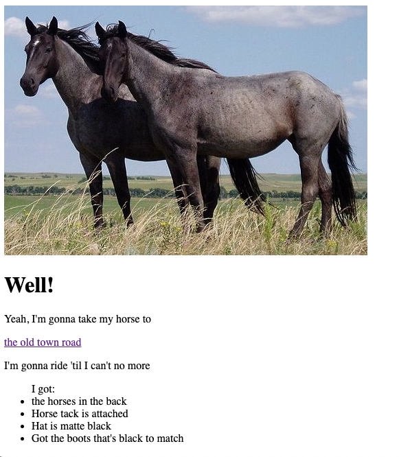

# Let's Play HTML Match-up

We've got some HTML tags that we need to match to our webpage.

### I'll show you a website like this

### And you need to match up the tags that would make up the website on the board.